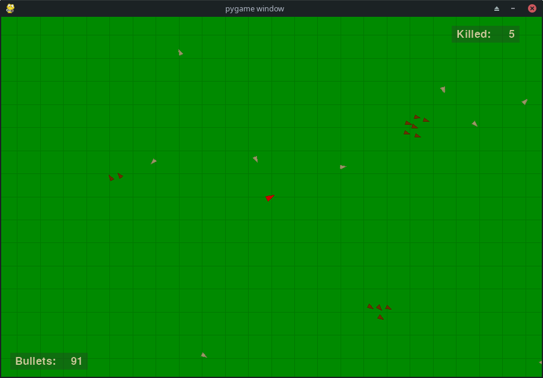
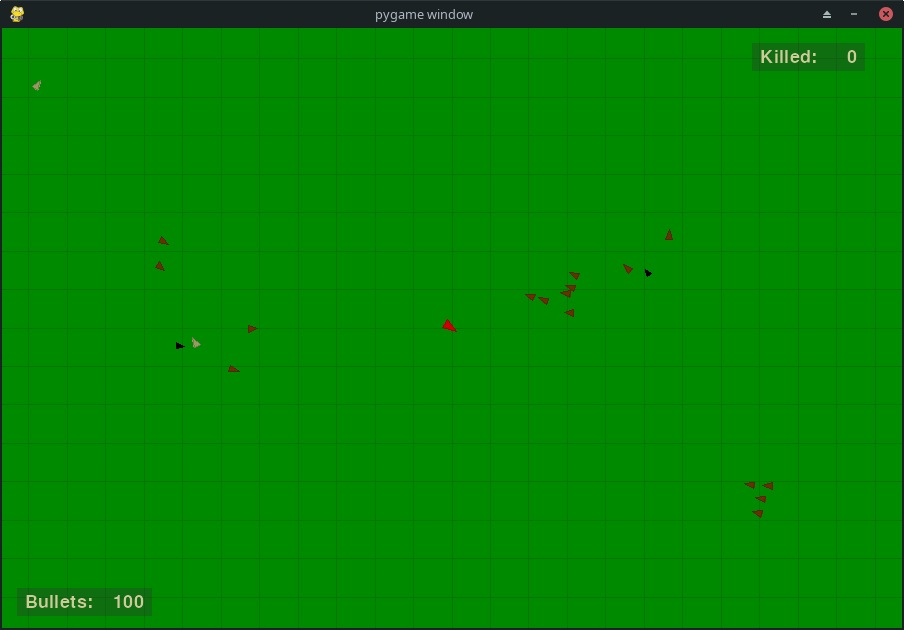
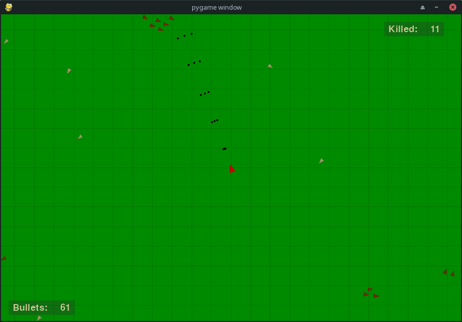

# Huntsman (Hunter)
This is simple 2D hunting game that uses steering behaviors.

## Useful links
- [PyGame](https://www.pygame.org/)
- [Autonomous Agents](https://natureofcode.com/book/chapter-6-autonomous-agents/)
- [Understanding Steering Behaviors](https://gamedevelopment.tutsplus.com/series/understanding-steering-behaviors--gamedev-12732)

## Autonomous agents
**Hunter**
- a player with shotgun who hunts animals
- can be killed by a wolf

**Hares**:
- move slowly (wandering)
- quickly run away from any other creatures, even other hares

**Fallow deer**: 
- that move (wander) and run away in groups
- rejoin the group if for some reason they get separated
- are afraid of hunters and wolves
- they sense wolves from afar and avoid them

**Wolves**:
- loners, attack hares, fallow deer and hunters
- they wander, but have a smaller radius of smell than deers
- after catching up with their prey they kill it
- die if they can't find their prey for some time

## Setup
Clone the repository and change the working directory:

    git clone https://github.com/alexandr-gnrk/huntsman.git
    cd huntsman
Create and activate the virtual environment:

    python3 -m venv ./venv
    source ./venv/bin/activate
Install requirements:

    pip3 install -r requirements.txt

## Usage

    usage: huntsman.py [-h] [-r WIDTH HEIGHT] [-ws WIDTH HEIGHT] [-hr HARES]
                       [-wl WOLVES] [-df DEERFLOCKS] [-cs CAMSCALE]

    Huntsman is a game that use steering behaviours.

    optional arguments:
      -h, --help            show this help message and exit
      -r WIDTH HEIGHT, --res WIDTH HEIGHT
                            game window resolution
      -ws WIDTH HEIGHT, --wsize WIDTH HEIGHT
                            size of game world
      -hr HARES, --hares HARES
                            amount of hares
      -wl WOLVES, --wolves WOLVES
                            amount of wolves
      -df DEERFLOCKS, --deerflocks DEERFLOCKS
                            amount of deer families
      -cs CAMSCALE, --camscale CAMSCALE
                            scale of camera inside game

### Examples
Run with pre-defined values:

    python3 huntsman.py

Run with specified resolution and world size:

    python3 huntsman.py --res 1024 768 -wsize 2500 2000

Run server with specified amount of animals:

    python3 huntsman.py --hares 10 --wolves 3 --deerflocks 4

## Screenshots

